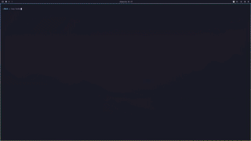

# 🔒 Lazy-Locker

[](https://opensource.org/licenses/MIT)
[](https://www.rust-lang.org/)

**A secure local secrets manager with TUI interface and SDK support.**

Lazy-Locker replaces plain-text `.env` files with encrypted local storage, providing seamless integration with Python and JavaScript/TypeScript projects.

<p align="center">
  
</p>

## ✨ Features

- 🔐 **AES-256-GCM encryption** for all secrets at rest
- 🔑 **Argon2id key derivation** for secure passphrase-based encryption
- 🖥️ **Terminal UI (TUI)** for easy secret management
- 🐍 **Python SDK** - drop-in replacement for `python-dotenv`
- 📦 **JavaScript/TypeScript SDK** - drop-in replacement for `dotenv`
- ⏰ **Expiration dates** for time-limited secrets
- 🔍 **Usage tracking** - see which files use your secrets
- 📋 **Clipboard support** - copy secrets with one keypress
- 🤖 **Agent-based architecture** - no passphrase needed after initial unlock

## 🚀 Quick Start

### Installation

```bash
# Clone and build
git clone https://github.com/WillIsback/lazy-locker.git
cd lazy-locker
cargo build --release

# Install globally
sudo cp target/release/lazy-locker /usr/local/bin/
```

### First Run

```bash
# Start Lazy-Locker and create your passphrase
lazy-locker
```

Press `a` to add your first secret, then use it in your code:

**Python:**

```python
from lazy_locker import inject_secrets
inject_secrets()

import os
api_key = os.environ["MY_API_KEY"]
```

**JavaScript/TypeScript:**

```javascript
import { injectSecrets } from 'lazy-locker';
await injectSecrets();

const apiKey = process.env.MY_API_KEY;
```

Run your scripts normally - no wrapper needed!

```bash
python my_script.py
uv run my_script.py
bun run my_script.ts
```

## 📖 Documentation

- [Getting Started](docs/getting-started.md)
- [Architecture](docs/architecture.md)
- [CLI Reference](docs/cli-reference.md)
- [SDK Guide](docs/sdk-guide.md)
- [Security](docs/security.md)

## ⌨️ Keyboard Shortcuts

| Key | Action |
|-----|--------|
| `↑/↓` | Navigate secrets |
| `a` | Add new secret |
| `e` | Reveal/hide value |
| `y` | Copy to clipboard |
| `d` | Delete secret |
| `h` | Show help |
| `q` | Quit |

## 🔧 CLI Commands

```bash
lazy-locker              # Open TUI
lazy-locker status       # Check agent status
lazy-locker stop         # Stop agent
lazy-locker run <cmd>    # Run command with secrets injected
lazy-locker help         # Show help
```

## 📦 SDK Installation

**Python:**

```bash
pip install lazy-locker
# or: uv add lazy-locker
```

**JavaScript/TypeScript:**

```bash
npm install lazy-locker
# or: pnpm add lazy-locker
# or: bun add lazy-locker
```

## 🔐 Security

- **Encryption:** AES-256-GCM
- **Key Derivation:** Argon2id
- **Memory Safety:** Sensitive data zeroized after use
- **No Plain Text:** Secrets never written to disk unencrypted

See [Security Documentation](docs/security.md) for details.

## 🤝 Contributing

Contributions are welcome! Please feel free to submit a Pull Request.

1. Fork the repository
2. Create your feature branch (`git checkout -b feature/amazing-feature`)
3. Commit your changes (`git commit -m 'Add amazing feature'`)
4. Push to the branch (`git push origin feature/amazing-feature`)
5. Open a Pull Request

## 📄 License

This project is licensed under the MIT License - see the [LICENSE](LICENSE) file for details.

## 🙏 Acknowledgments

- Built with [Ratatui](https://ratatui.rs/) for the TUI
- Cryptography by [RustCrypto](https://github.com/RustCrypto)
- Developed with assistance from **Claude Opus 4.5** (Anthropic) - AI pair programming was used ethically to accelerate development while maintaining code quality and security best practices

## 👤 Author

**William Derue** ([@WillIsback](https://github.com/WillIsback))

---

<p align="center">
  Made with ❤️ and 🦀
</p>
